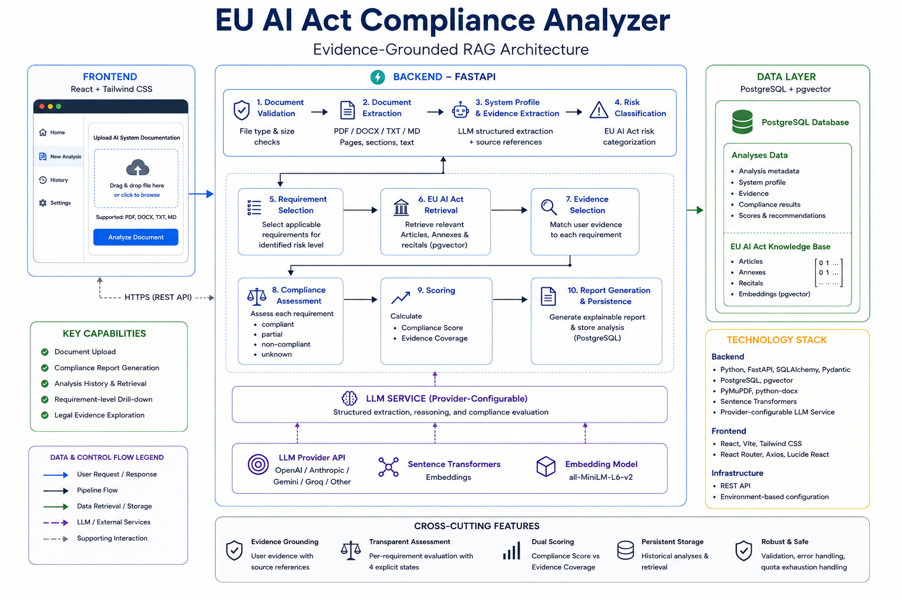
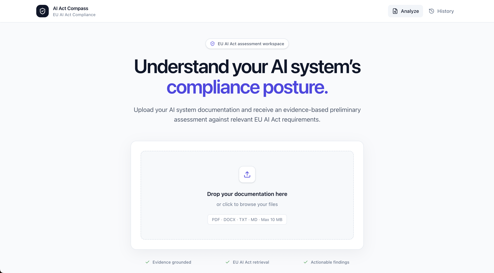
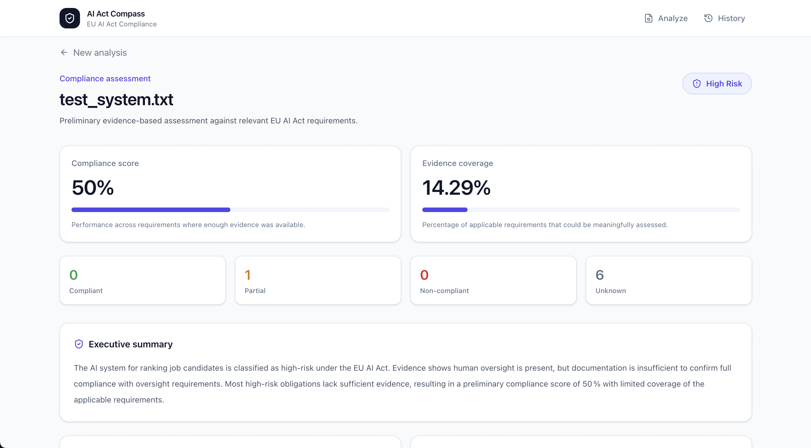
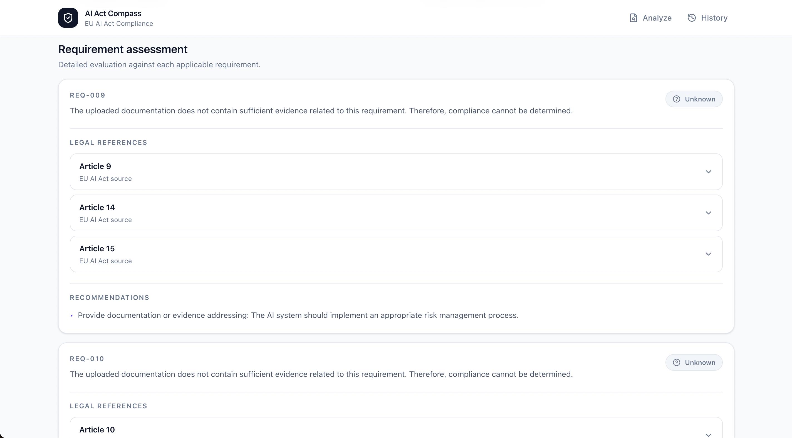
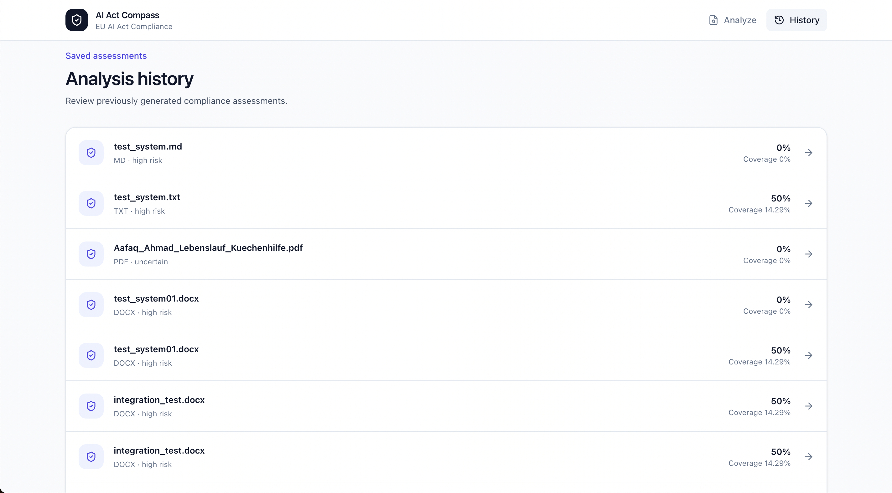

# EU AI Act Compliance Analyzer

> An evidence-grounded RAG system for analyzing AI system documentation against relevant requirements of the **EU AI Act**.

The application accepts technical documentation describing an AI system, extracts a structured system profile, determines the applicable AI Act risk category, retrieves relevant legal provisions, evaluates available evidence against individual requirements, and generates an explainable compliance assessment.


> **Disclaimer:** This project is an AI-assisted compliance assessment and decision-support tool. It does not provide legal advice or constitute a formal determination of EU AI Act compliance.

---

## Overview

Organizations developing or deploying AI systems may need to understand which EU AI Act obligations apply to their systems and whether their existing documentation provides sufficient evidence of compliance.

This project explores how **Retrieval-Augmented Generation (RAG), structured information extraction, semantic retrieval, vector search, and LLM-based reasoning** can support that process.

Instead of asking an LLM to evaluate an entire document against the entire regulation in a single prompt, the application uses a structured, evidence-grounded pipeline.

1. Validate and extract the uploaded document.
2. Convert the document into a structured AI system profile.
3. Preserve evidence supporting extracted facts.
4. Classify the AI system under the EU AI Act risk framework.
5. Identify relevant compliance requirements.
6. Retrieve corresponding EU AI Act provisions.
7. Match user evidence to individual requirements.
8. Evaluate each requirement independently.
9. Calculate compliance and evidence-coverage scores.
10. Generate and persist an explainable report.

---

## Key Features

- Upload AI system documentation in **PDF, DOCX, Markdown, or TXT**
- Structured AI system profile extraction using an LLM
- Evidence-grounded extraction with source references
- EU AI Act risk classification
- Retrieval of relevant Articles and Annexes
- Requirement-specific evidence selection
- Compliance assessment per requirement
- Four assessment states:
  - `compliant`
  - `partial`
  - `non_compliant`
  - `unknown`
- Separate compliance and evidence-coverage scoring
- Explainable findings with user and legal evidence
- Actionable recommendations
- PostgreSQL persistence for generated analyses
- Analysis history and saved-report retrieval
- REST API built with FastAPI
- Modern React dashboard for report visualization
- Automated unit and integration testing
- Health and readiness endpoints
- LLM quota/error handling
- CI-ready project structure

---

## System Architecture



The architecture separates document understanding, legal retrieval, evidence selection, compliance reasoning, scoring, and persistence instead of relying on a single unrestricted LLM prompt.

---

## Why Evidence Grounding?

A major design goal of the project is to avoid treating an LLM response itself as sufficient evidence.

The pipeline distinguishes between two types of evidence.

### User Evidence

Evidence extracted directly from the AI system documentation uploaded by the user.

Example:

```text
HR staff review AI-generated recommendations and can override rankings.
```

User evidence retains its source location so that generated assessments can be traced back to the uploaded documentation.

### Legal Evidence

Relevant provisions retrieved from the indexed EU AI Act knowledge base.

Example:

```text
Article 14 — Human Oversight
```

The compliance analyzer evaluates relevant user evidence against the corresponding legal requirement instead of comparing every document statement against every provision.

This reduces unnecessary LLM calls, improves traceability, and keeps individual assessments focused on the relevant requirement.

---

## Compliance Assessment

Applicable requirements are evaluated independently.

| Status            | Meaning                                                             |
| ----------------- | ------------------------------------------------------------------- |
| **Compliant**     | Available evidence sufficiently demonstrates the requirement        |
| **Partial**       | Some evidence exists, but the requirement is not fully demonstrated |
| **Non-compliant** | Evidence indicates that the requirement is not satisfied            |
| **Unknown**       | The uploaded documentation does not provide enough evidence         |

`Unknown` is intentionally different from `Non-compliant`.

Missing documentation should not automatically be interpreted as proof that an AI system violates a legal requirement.

---

## Compliance Score vs Evidence Coverage

The project deliberately separates two different concepts.

### Compliance Score

Measures performance across requirements for which sufficient evidence was available.

### Evidence Coverage

Measures how much of the applicable compliance framework could actually be assessed from the uploaded documentation.

For example:

```text
Compliance Score: 50%
Evidence Coverage: 14.29%
```

A moderate compliance score with very low evidence coverage should **not** be interpreted as strong overall compliance.

This distinction prevents missing information from being hidden behind a seemingly positive score and makes uncertainty visible to the user.

---

## Example Use Case

Consider an AI recruitment system that:

- analyzes candidate profiles
- generates candidate rankings
- processes applicant personal data
- provides recommendations to HR staff
- allows HR staff to override AI recommendations

The pipeline can identify recruitment as a potentially **high-risk AI use case**, retrieve relevant EU AI Act requirements, and evaluate whether the uploaded documentation contains sufficient evidence for areas such as:

- risk management
- data governance
- technical documentation
- record keeping
- transparency
- human oversight
- accuracy and robustness
- cybersecurity

The resulting report highlights strengths, weaknesses, missing information, requirement-level findings, legal references, and recommended actions.

---

## Technology Stack

### Backend

- Python 3.11
- FastAPI
- Pydantic
- SQLAlchemy
- PostgreSQL
- pgvector
- PyMuPDF
- python-docx
- Sentence Transformers
- Groq-hosted LLM
- pytest

### Frontend

- React
- Vite
- Tailwind CSS
- React Router
- Axios
- Lucide React

### AI / Retrieval

- Large Language Models
- Retrieval-Augmented Generation
- Semantic embeddings
- Vector similarity search
- Hybrid legal retrieval
- Structured JSON extraction
- Evidence-grounded compliance reasoning

---

## Project Structure

```text
eu-ai-act-rag/
│
├── backend/
│   ├── app/
│   │   ├── api/
│   │   ├── core/
│   │   ├── db/
│   │   ├── models/
│   │   ├── repositories/
│   │   └── services/
│   │
│   ├── evaluation/
│   ├── scripts/
│   ├── tests/
│   │   ├── integration/
│   │   └── unit/
│   │
│   ├── ARCHITECTURE.md
│   ├── README.md
│   ├── requirements.txt
│   └── .env.example
│
├── frontend/
│   ├── public/
│   └── src/
│       ├── components/
│       ├── pages/
│       └── services/
│
├── docs/
│   ├── architecture.png
│   └── screenshots/
│       ├── home.png
│       ├── report.png
│       ├── legal-reference.png
│       └── history.png
│
├── LICENSE
└── README.md
```

---

## Backend Pipeline

The main analysis pipeline follows:

```text
Uploaded Document
       ↓
File Validation
       ↓
Document Extraction
       ↓
System Profile Extraction
       ↓
User Evidence Extraction
       ↓
Risk Classification
       ↓
Requirement Selection
       ↓
EU AI Act Retrieval
       ↓
Requirement-specific Evidence Selection
       ↓
Compliance Analysis
       ↓
Scoring
       ↓
Report Generation
       ↓
PostgreSQL Persistence
```

### Pipeline Design

The pipeline deliberately separates responsibilities:

**Document Extraction**  
Converts PDF, DOCX, Markdown, and text documents into a normalized internal representation.

**System Profile Extraction**  
Uses the LLM to convert unstructured AI system documentation into structured system information.

**Risk Classification**  
Determines the relevant EU AI Act risk category using the extracted system profile and legal context.

**Legal Retrieval**  
Retrieves relevant EU AI Act Articles and Annexes from the indexed legal knowledge base.

**Evidence Selection**  
Selects only user evidence relevant to a particular compliance requirement.

**Compliance Analysis**  
Evaluates each requirement using its corresponding user and legal evidence.

**Scoring**  
Separates compliance performance from evidence coverage.

**Persistence**  
Stores completed analyses in PostgreSQL so they can be retrieved without rerunning the complete LLM pipeline.

---

## API

### Generate Compliance Report

```http
POST /api/documents/report
```

Accepts an uploaded AI system document and executes the complete compliance pipeline.

### Extract Document

```http
POST /api/documents/extract
```

Validates and extracts supported documents.

### Analysis History

```http
GET /api/analyses
```

Returns stored analyses.

### Analysis Detail

```http
GET /api/analyses/{analysis_id}
```

Returns a previously generated analysis.

### Health

```http
GET /api/health
```

### Readiness

```http
GET /api/ready
```

When running locally, interactive FastAPI documentation is available at:

```text
http://localhost:8000/docs
```

---

## Local Development

### 1. Clone the Repository

```bash
git clone https://github.com/codefromahmad/eu-ai-act-rag.git
cd eu-ai-act-rag
```

### 2. Backend

```bash
cd backend

python3.11 -m venv .venv
source .venv/bin/activate

pip install -r requirements.txt
```

Create the environment configuration:

```bash
cp .env.example .env
```

Configure the required database and LLM credentials in `.env`.

Initialize the database as required by the backend setup, then start the API:

```bash
python -m uvicorn app.main:app --reload
```

The FastAPI server runs locally at:

```text
http://localhost:8000
```

Interactive API documentation:

```text
http://localhost:8000/docs
```

### 3. Frontend

Open another terminal from the repository root:

```bash
cd frontend
npm install
npm run dev
```

The Vite development server runs locally at:

```text
http://localhost:5173
```

---

## Testing

The backend contains unit and integration tests covering the main application behavior.

Run:

```bash
cd backend
source .venv/bin/activate
pytest tests -v
```

Current test suite:

```text
23 passed
```

Tests cover:

- document validation
- document extraction
- evidence selection
- compliance analysis
- scoring
- pipeline orchestration
- document API behavior
- analysis persistence API
- health and readiness endpoints
- API error handling
- LLM quota exhaustion handling

---

## Frontend Production Build

Create an optimized frontend build with:

```bash
cd frontend
npm run build
```

The resulting Vite production bundle is generated under:

```text
frontend/dist/
```

---

## Reliability and Safety Considerations

The project intentionally includes several safeguards:

- missing information is represented explicitly
- unsupported evidence should not be fabricated
- user evidence retains source references
- legal evidence remains traceable to EU AI Act provisions
- requirements are evaluated independently
- evidence coverage is separated from compliance score
- external LLM quota failures are handled by the API
- file type and size validation occur before analysis
- completed analyses can be retrieved without rerunning the LLM pipeline

---

## Application Screenshots

### Analyze an AI System

Upload AI system documentation and start an evidence-grounded EU AI Act compliance assessment.



### Compliance Report

The generated report presents the system's risk classification, compliance score, evidence coverage, strengths, weaknesses, missing information, and recommendations.



### Requirement-Level Assessment

Each applicable requirement is assessed independently using evidence from the uploaded documentation and retrieved EU AI Act provisions.

Legal references can be expanded to inspect the underlying EU AI Act text used by the assessment.



### Analysis History

Completed analyses are persisted in PostgreSQL and can be reopened without running the LLM pipeline again.



---

## Limitations

This is a portfolio and research-oriented implementation rather than a certified legal compliance product.

Current limitations include:

- LLM outputs can still contain reasoning errors
- retrieval quality depends on the indexed legal corpus
- compliance interpretation can require legal expertise
- uploaded documentation may omit important operational information
- a high compliance score with low evidence coverage should not be treated as proof of compliance
- regulatory guidance and interpretation may evolve
- external LLM services introduce availability and quota dependencies

A production compliance system would require additional legal review, security hardening, privacy controls, evaluation, auditability, monitoring, and regulatory-change management.

---

## Future Improvements

Potential extensions include:

- stronger retrieval evaluation
- citation-level legal traceability
- provider/deployer-specific obligation analysis
- additional EU AI Act risk categories and obligations
- regulatory knowledge-base versioning
- asynchronous analysis jobs
- authentication and multi-user workspaces
- PDF report export
- configurable LLM providers
- richer evaluation datasets
- deployment monitoring and observability

---

## What This Project Demonstrates

This project demonstrates practical experience with:

- designing an end-to-end RAG architecture
- building LLM-backed backend services
- structured extraction from unstructured documents
- semantic and vector retrieval
- evidence-grounded LLM reasoning
- prompt and schema design
- FastAPI API development
- PostgreSQL and pgvector
- React frontend development
- AI system evaluation
- automated unit and integration testing
- error handling for external AI services
- translating regulatory documents into machine-assisted analysis workflows

---

## Author

**Aafaq Ahmad**

Software Engineering · Natural Language Processing · AI Engineering

GitHub: `@codefromahmad`

---

## License

This project is licensed under the [MIT License](LICENSE).

---

## Disclaimer

This software is provided for educational, research, and portfolio purposes.

The generated assessments are informational and should not be interpreted as legal advice, certification, or a definitive determination of compliance with Regulation (EU) 2024/1689 or any other applicable law.
